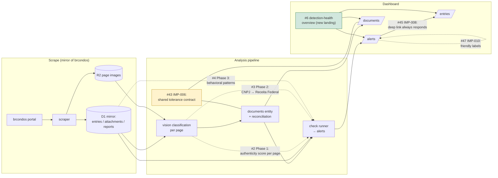
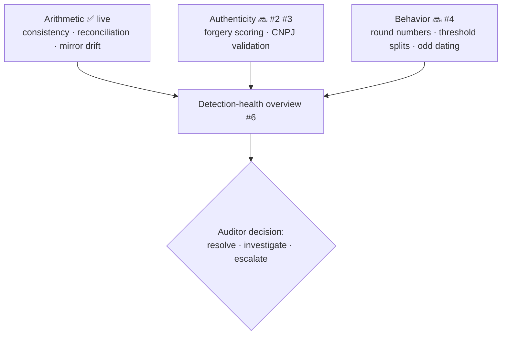

# Improvements roadmap — what lands when the open tickets merge

_Last updated: 2026-06-12. Source of truth: the repo's GitHub issues (the `IMP-*` series and the
Phase 1–3 fraud-detection tickets). Statuses below reflect GitHub at the time of writing; the
`speckit-issue-loop` works the open set one issue at a time._

## Where each ticket sits

| Ticket      | Title                                                  | Status                                                   | What you will see                                                                |
| ----------- | ------------------------------------------------------ | -------------------------------------------------------- | -------------------------------------------------------------------------------- |
| #43 IMP-006 | Shared tolerance contract (Python ↔ TypeScript)        | **in progress** (branch `036-shared-tolerance-contract`) | The documents page badge and the `document_overpayment` alert can never disagree |
| #45 IMP-008 | Entries deep link fails silently                       | open                                                     | Every alert → entry click gives feedback, even when the entry is gone            |
| #47 IMP-010 | Alert type filter shows raw snake_case                 | open                                                     | Human-readable alert types everywhere                                            |
| #6          | Detection-health overview landing page                 | open                                                     | One screen answering "is anything wrong right now?"                              |
| #2          | Phase 1: VLM forgery/authenticity scoring              | open                                                     | Forged-but-consistent documents stop passing silently                            |
| #3          | Phase 2: CNPJ validation (Receita Federal / BrasilAPI) | open                                                     | Shell/ghost vendors get flagged                                                  |
| #4          | Phase 3: Behavioral fraud-pattern checks               | open                                                     | Manipulation patterns in consistent books get flagged                            |

Recently merged for context (already live): atomic writebacks (BUG-006), mirror-table purity +
`attachment_state` (BUG-002), re-scrape preservation & portal-deletion reconciliation (BUG-001/004,
with the `portal_row_vanished` fraud signal), alert resolution preserved across re-runs (BUG-003),
stale document pruning (BUG-005), raw portal provenance + tolerant parser (IMP-001), scrape-time
consistency validation with `scrape_inconsistency` alerts (IMP-002), order-independent entry ids
(IMP-003), `attachment_not_downloaded` alerts for partial downloads (IMP-004), self-cleaning
`page_classifications` staging (IMP-005), string entry-id typing (IMP-007), and alerts-list
freshness on tab return (IMP-009).

## Improvements by theme

### 1. Detection integrity — the numbers can't drift (#43, IMP-006)

Today the over/within/under decision exists twice: `scripts/analysis/nf_groups.py` (drives
`amount_match`, shared-NF reconciliation, and the `document_overpayment` alert) and
`src/lib/documents.ts` (drives the `/dashboard/documents` status badge). They are identical now,
but nothing enforces it.

**After merge:**

- One canonical tolerance contract shared by both languages (a contract-test fixture both sides
  must pass), so a tolerance tweak is a single edit.
- It becomes impossible for a document to show **"within"** on the dashboard while an unresolved
  **`document_overpayment`** alert points at the same document — the UI and the alert engine read
  the same rule.

### 2. Dashboard trust & ergonomics (#45, #47, #6)

**IMP-008 — alert → entry deep links always respond.** Clicking "view affected entry" on an alert
currently does _nothing visible_ when the entry isn't in the loaded period (stale alert after a
re-scrape, re-minted entry id, active filters hiding the row). After merge you always get feedback:
the row scrolls/highlights as today when present, and when it isn't you see an explicit notice of
_why_ (not in this period / removed / filtered out) instead of a silent ordinary list.

**IMP-010 — readable alert vocabulary.** Filters, badges, and the detail page stop showing
`attachment_amount_mismatch` and show "Attachment amount mismatch", from one shared label map with
a Title Case fallback — so alert types added by future checks (see Phases 1–3 below) render
properly on day one.

**#6 — detection-health overview.** `/dashboard` stops redirecting to the raw reports table and
instead answers the auditor's first question at a glance: active critical/warning alert counts,
documents with mismatches or analysis errors, affected periods, and links into each detail page.
This is the screen that makes the nightly automated pipeline _observable_ — and it is where the new
Phase 1–3 signals will surface.

### 3. New fraud-detection capability (#2, #3, #4 — the scope's three phases)

These extend detection beyond "books that don't add up" to the three classes of fraud that
internally-consistent books can hide:

**Phase 1 (#2) — visual forgery detection.** The vision pipeline today only _extracts_ values; a
perfectly forged receipt passes every check. After merge each page also gets an authenticity
assessment (a new per-page `analysis_type` — the schema was designed for this, no migration), and
suspicious pages raise a forgery alert with the page image one click away.

**Phase 2 (#3) — vendor existence validation.** Extracted issuer CNPJs get validated against
Receita Federal public data (BrasilAPI): nonexistent or inactive CNPJs, registered-name vs
document-issuer mismatches, and recently-created entities raise alerts. This closes the
**ghost-vendor** vector that no internal consistency check can catch, and hardens the existing
`vendor_match` signal with an authoritative source.

**Phase 3 (#4) — behavioral pattern checks.** Pure in-database heuristics over the existing
`entries` data: round-number bias (R$ 5.000,00 exactly), clustering just below approval thresholds,
weekend/holiday-dated expenses, and split transactions (one large expense fragmented across
same-vendor/same-day entries). Each lands as a new alert type through the existing check-runner and
dashboard plumbing.

## Where each improvement lands in the pipeline

Dashed arrows = capabilities that do not exist yet; they are the open tickets.

## The end state, in one paragraph

When everything above is merged, the system goes from "books that don't reconcile get flagged" to a
three-pillar audit: **arithmetic** (consistency, reconciliation, mirror-drift — already live),
**authenticity** (forged pages, ghost vendors — Phases 1–2), and **behavior** (manipulation
patterns in consistent data — Phase 3). All of it surfaces through a single trustworthy dashboard:
a landing page that says whether anything is wrong, alert vocabulary a human can read, deep links
that never dead-end silently, and a UI that mathematically cannot disagree with the alert engine
about whether a document is overpaid.

