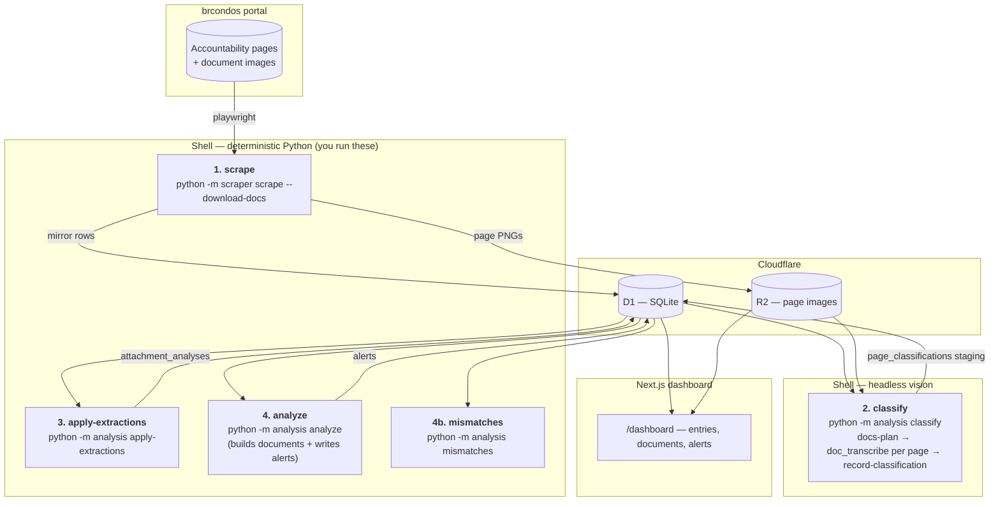
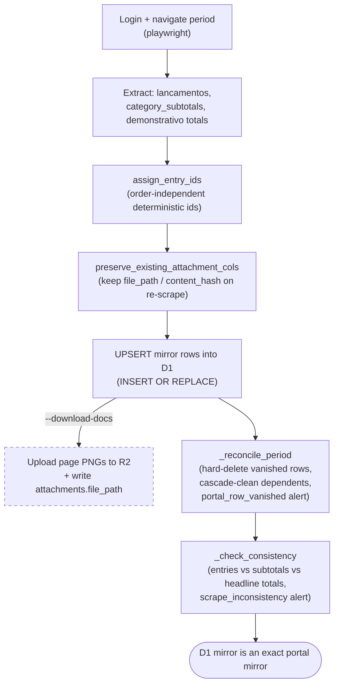
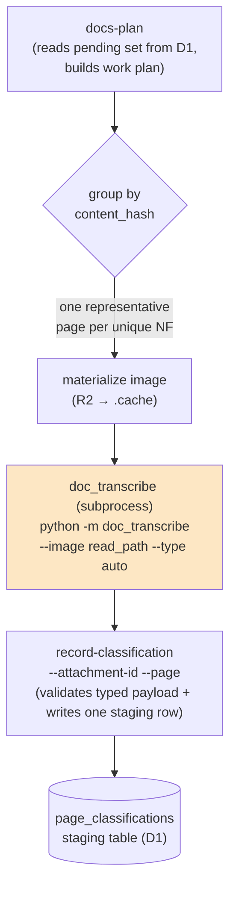
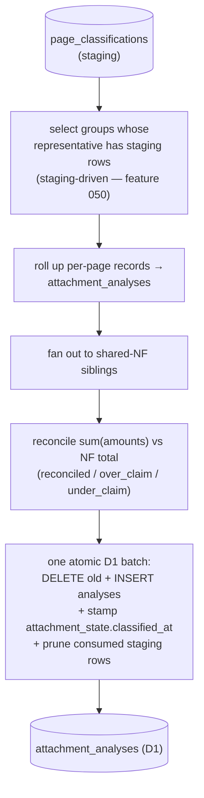
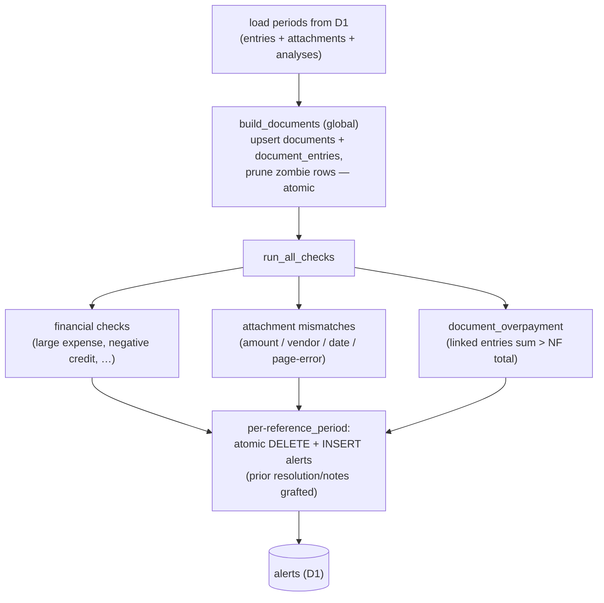
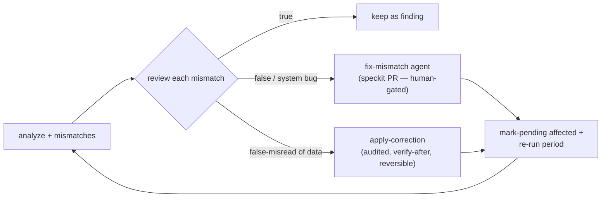

# The Full Pipeline — End to End

How a period's data goes from the brcondos portal to verified alerts on the
dashboard, and how to drive it — either all at once, or one step at a time.

> **Where commands run.** Every Python command runs from the `scripts/`
> directory through `uv`, e.g. `cd scripts && uv run python -m analysis …`.
> The repo's `Makefile` wraps the most common ones. All commands default to the
> **local** Miniflare D1/R2; pass `--remote` to hit **production**.
>
> **The vision / classification step is the one that needs an LLM.** Reading the
> page images and extracting their fields is an LLM-with-vision task. It runs as a
> single **headless** CLI command — `python -m analysis classify` — which shells
> out to the `doc_transcribe` tool (`claude -p` or the Anthropic API) per page and
> records the typed fields to D1. There is no interactive skill path. Everything
> before and after it is deterministic Python. See [Step 2](#step-2--classify-vision).

---

## TL;DR — run a period end to end

The whole flow for one period (`2026-01`) is four shell commands — all headless,
no interactive step:

```bash
cd scripts

# 1. Scrape the period's ledger into D1 and upload its page images to R2.
uv run python -m scraper scrape --periodo 2026-01 --download-docs

# 2. Classify the pending pages (headless vision — shells out to doc_transcribe).
uv run python -m analysis classify --periodo 2026-01

# 3. Roll up the extractions, run the checks, print the mismatch summary.
uv run python -m analysis apply-extractions --periodo 2026-01
uv run python -m analysis analyze --periodo 2026-01
uv run python -m analysis mismatches --periodo 2026-01
```

`classify → apply-extractions → analyze → mismatches` is the full vision+analysis
pass — all plain CLI steps. `classify` is the only step that needs an LLM; it
drives `doc_transcribe` per page and records the typed fields to D1.

If classification is already done (or you want to re-run just the checks), skip
step 2 and run the deterministic per-step commands below.

---

## The pipeline at a glance



**The contract between the steps is D1 (and R2), never files.** Each step reads
its inputs from the database and writes its outputs back, so steps are
independently re-runnable and the ephemeral `.cache/analysis/` can be wiped at
any time without losing work.

| #   | Step                        | Command                                                                        | Runs where                        |
| --- | --------------------------- | ------------------------------------------------------------------------------ | --------------------------------- |
| 0   | Setup                       | `make setup`                                                                   | shell (once)                      |
| 1   | Scrape                      | `python -m scraper scrape --periodo <p> --download-docs`                       | shell                             |
| 2   | Classify (vision)           | `python -m analysis classify --periodo <p>` (drives `doc_transcribe` per page) | shell (LLM via `claude -p` / API) |
| 3   | Apply extractions           | `python -m analysis apply-extractions --periodo <p>`                           | shell                             |
| 4   | Analyze (+ build documents) | `python -m analysis analyze --periodo <p>`                                     | shell                             |
| 4b  | Mismatch summary            | `python -m analysis mismatches --periodo <p>`                                  | shell                             |
| 5   | View                        | `pnpm preview` → `/dashboard`                                                  | shell + browser                   |

> **`--periodo` takes one or more periods** (`--periodo 2026-01 2025-12`); omit
> it to process **all** periods. `build-documents` is intentionally **global**
> (no `--periodo`) and is invoked automatically inside `analyze`.

---

## Step 0 — Setup (once)

Install the Python toolchain and the Playwright browser the scraper drives.

```bash
make setup
# == cd scripts && uv sync && uv run playwright install chromium
```

Apply D1 migrations locally before the first run:

```bash
pnpm db:migrate:dev      # local Miniflare D1
# pnpm db:migrate:prod   # production D1
```

---

## Step 1 — Scrape

Logs into brcondos, extracts each period's **mirror** rows (`entries`,
`attachments`, `accountability_reports`, `category_subtotals`, `approvers`) into
D1, and — with `--download-docs` — uploads each attachment's page PNGs to R2.

```bash
# Scrape one period + download its images (local D1/R2):
cd scripts && uv run python -m scraper scrape --periodo 2026-01 --download-docs

# Interactive menu (pick periods / actions):
make scrape            # == cd scripts && uv run python -m scraper

# Production:
cd scripts && uv run python -m scraper scrape --periodo 2026-01 --download-docs --remote

# Backfill only the images for already-scraped periods:
cd scripts && uv run python -m scraper download-docs --periodo 2026-01
```

The scrape does more than a naive dump — after a period's rows are upserted it
preserves scraper-owned linkage, reconciles portal deletions, and cross-checks
the ledger for internal consistency.



> **Mirror invariant.** `entries` / `attachments` / `accountability_reports` are
> an exact copy of the portal — **only the scraper writes them**. Everything the
> analysis derives lives in analysis-owned tables, so the mirror can be diffed
> against a fresh scrape for forgery detection.

---

## Step 2 — Classify (vision)

**This is the only LLM step, and it is headless.** A single CLI command reads
each unique document's page image(s), extracts the typed fields, and records one
row per page into the `page_classifications` staging table in D1.

```bash
make classify
# == cd scripts && uv run python -m analysis classify --periodo 2026-01
#    [--min-amount N] [--limit N] [--backend cli|api] [--model …]
```

Under the hood `classify` builds the same **pending** plan `docs-plan` produces,
materializes the page images from R2, and for each pending non-`recorded` page
shells out to `tools/doc_transcribe` **as a subprocess**, takes the typed
EXTRACT-001 `fields` object it returns, and records it via `record-classification`.
Pages are processed **serially**.



```bash
# The plan itself (DB-derived, printed as JSON — no manifest file):
make docs-plan
# == cd scripts && uv run python -m analysis docs-plan --periodo 2026-01
```

> **Work selection is DB-controlled.** The plan is the **pending set** — any
> attachment with no `attachment_state` row or `classified_at IS NULL`. To
> re-classify a subset, mark it pending first:
>
> ```bash
> cd scripts && uv run python -m analysis mark-pending --attachment-id <id> …
> ```
>
> Shared NFs are grouped by byte-identical `content_hash`, so the extraction
> runs **once** per unique invoice; siblings inherit it during apply.

### Backends and error handling

The `--backend` flag selects how `doc_transcribe` reaches a model:

- **`cli`** (default) — shells out to `claude -p` (needs the `claude` binary on
  PATH; no Anthropic SDK / API key).
- **`api`** — uses the Anthropic SDK.

`--model` overrides the model. The tool itself can be run standalone to inspect
its output (`python -m doc_transcribe --image <png> --type auto` prints
`{doc_type, schema_version, fields[, parse_errors]}` to stdout); `tools/doc_transcribe`
is used **as-is** and stays repo-agnostic.

Two failure modes are handled distinctly:

- **Config error** — the subprocess exits non-zero (e.g. `claude` not on PATH).
  The run **stops** with a clear message; there is **no silent fallback**.
- **Per-page transcription error** — the subprocess exits 0 but returns
  `parse_errors` / no usable fields. `classify` records an `{"error": …}` row for
  that page and **continues** to the next.

---

## Step 3 — Apply extractions

Reads each page's recorded extraction from the `page_classifications` staging
table, rolls it up into the **authoritative** `attachment_analyses` (+ flattened
`attachment_analysis_records`), fans a shared NF's extraction out to its
siblings, reconciles `sum(sibling amounts)` against the NF gross total, and
stamps the attachment classified.

```bash
make apply-extractions
# == cd scripts && uv run python -m analysis apply-extractions --periodo 2026-01
```



> **Atomic + self-healing.** The delete + insert + classified-stamp + staging
> prune are one D1 batch, so a failed write leaves the attachment **pending**
> (re-runs heal it), never stamped-but-empty. A pending attachment with **no**
> staging rows is skipped, so it can never be overwritten with an empty roll-up.

---

## Step 4 — Analyze

Builds the global **documents** entity, then runs the financial / consistency /
fraud checks and writes the resulting **alerts** to D1. `build-documents` runs
automatically at the start of `analyze` (after load, before the checks).

```bash
make analyze
# == cd scripts && uv run python -m analysis analyze --periodo 2026-01
```



```bash
# build-documents on its own (global — rebuilds the documents entity):
cd scripts && uv run python -m analysis build-documents
```

### Step 4b — Mismatch summary

Prints the terse classification-mismatch summary (same detector that feeds the
per-attachment alerts), with `page_refs` so a reviewer can open the evidence.

```bash
make mismatches
# == cd scripts && uv run python -m analysis mismatches --periodo 2026-01
```

---

## Step 5 — View on the dashboard

```bash
pnpm preview     # build + local Cloudflare preview at http://localhost:3000
# pnpm dev       # plain Next.js dev server (no Workers runtime)
```

Then open `/dashboard` — **entries**, **documents** (with over/within/under
badges), and **alerts** (with deep links into the offending entry + its analysis
dialog). The dashboard reads the same D1/R2 the pipeline wrote.

---

## Beyond the happy path — review & correction loops

These are _not_ part of the basic run; reach for them when classification needs
tuning or you're scrubbing false positives.



- **`improve-classification` skill** — the self-improving loop: analyze → review
  each mismatch → fix each _system bug_ via a human-gated PR → re-queue affected
  attachments → repeat until convergence. Bookkeeping lives in the `loop-state` /
  `record-verdict` CLI.
  Run it for: _"run the classification improvement loop for 2026-01"_.

- **`triage-false-positives` skill** — fans out one `fix-document-findings` agent
  per candidate document; each views its own page image(s) and autonomously
  data-corrects demonstrable misreads via the audited correction path.
  Run it for: _"triage the false positives for 2026-01"_.

- **Manual data correction CLIs** (audited + reversible):

    ```bash
    cd scripts && uv run python -m analysis apply-correction --attachment-id <id> \
        --target-finding <mismatch_key> --pages '{"p1": {…}}'
    cd scripts && uv run python -m analysis list-corrections --periodo 2026-01
    cd scripts && uv run python -m analysis undo-correction --id <batch_id>
    ```

    The un-gated sibling `reclassify --attachment-id <id> --pages '{…}'` records
    corrected staging then propagates (apply → build-documents → analyze) for the
    attachment's period.

- **`re-derive`** — image-free systematic re-run of the deterministic mappers
  over the _stored_ transcriptions (no vision cost), to roll out a mapper fix:

    ```bash
    cd scripts && uv run python -m analysis re-derive --periodo 2026-01
    ```

---

## Local vs. remote, and the cache

- **Local (default)** — Miniflare D1 + R2 fabricated on disk. Everything works
  offline once a period is scraped locally.
- **Remote** — every command takes `--remote` to read/write **production** D1/R2.
  The scrape's `--remote` writes the production mirror.
- **`.cache/analysis/<period>/`** — ephemeral local scratch (R2 images
  materialized for vision, verdict bookkeeping). Gitignored and safe to delete;
  the pipeline re-materializes what it needs from R2.
