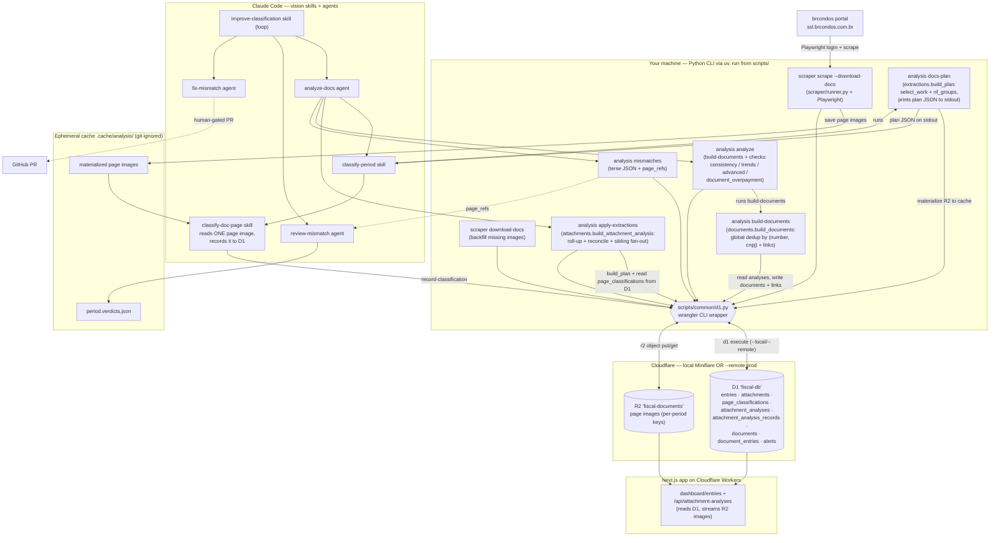
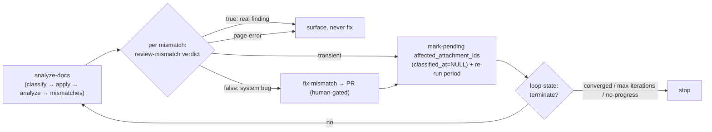

# Scrape & Analysis Pipeline — Flow

How the scrape → classify → analyze pipeline runs, and **where** each step executes.
For command reference and usage, see [`scripts/README.md`](./README.md).

## What runs where

| Step                                                                                  | Runs in                                                      | Entry point                                                |
| ------------------------------------------------------------------------------------- | ------------------------------------------------------------ | ---------------------------------------------------------- |
| Scrape ledger + download attachments                                                  | **Your machine** (Python + Playwright, run from `scripts/`)  | `python -m scraper scrape --download-docs [--remote]`      |
| Backfill missing attachment images                                                    | Your machine                                                 | `python -m scraper download-docs [--remote]`               |
| Plan extraction work (DB-derived, printed to stdout)                                  | Your machine                                                 | `python -m analysis docs-plan [--remote]`                  |
| Read ONE page image → fields, record to D1                                            | **Claude Code** (vision skill) + `record-classification` CLI | `classify-doc-page` skill                                  |
| Orchestrate per-page classification                                                   | Claude Code                                                  | `classify-period` skill (runs `docs-plan`, fans out pages) |
| Merge classifications → roll-up + reconcile                                           | Your machine                                                 | `python -m analysis apply-extractions [--remote]`          |
| Run checks → write alerts (incl. per-attachment mismatch alerts, clickable in the UI) | Your machine                                                 | `python -m analysis analyze [--remote]`                    |
| Terse mismatch summary                                                                | Your machine                                                 | `python -m analysis mismatches [--remote]`                 |
| One-shot vision+analysis wrapper                                                      | Claude Code                                                  | `analyze-docs` agent                                       |
| Judge a mismatch true/false                                                           | Claude Code                                                  | `review-mismatch` agent                                    |
| Fix a false mismatch → PR                                                             | Claude Code                                                  | `fix-mismatch` agent (human-gated PR)                      |
| Drive the whole loop                                                                  | Claude Code                                                  | `improve-classification` skill                             |

**Key seams**

- All Python ↔ Cloudflare access goes through **`scripts/common/d1.py`**, a thin wrapper around the `wrangler` CLI (`d1 execute`, `r2 object put/get`). The `--remote` flag selects **production** Cloudflare; default is **local Miniflare** (`.wrangler/state`).
- D1 (`DATABASE` → `fiscal-db`) and R2 (`DOCUMENTS` → `fiscal-documents`) are the source of truth. There is **no** `data/scrape/*.json` anymore.
- `.cache/analysis/<period>/` is **ephemeral, git-ignored scratch** (materialized images and the loop's `*.verdicts.json`). Reproducible from R2; never a source of truth. Per-page classifications live in **D1** (`page_classifications`), not the cache, so clearing scratch never loses vision work. The extraction plan is **derived from D1 each run** (`attachments.content_hash` is the shared-NF grouping key); there is **no manifest file**.
- **Work selection is DB-controlled:** the plan is the _pending_ set — attachments with `classified_at IS NULL`. `apply-extractions` stamps `classified_at`; to (re)classify a subset, mark it pending via `analysis mark-pending --attachment-id <ids…>` (clears `classified_at`) rather than threading id flags through the classify pipeline.

## Architecture



## Happy path (end-to-end ordering)

```mermaid
sequenceDiagram
    autonumber
    actor U as You / Claude Code
    participant PW as Playwright
    participant P as brcondos portal
    participant W as wrangler (common/d1.py)
    participant D1 as D1 (fiscal-db)
    participant R2 as R2 (fiscal-documents)
    participant C as .cache/analysis/
    participant V as classify-doc-page (vision)

    U->>PW: scraper scrape --download-docs
    PW->>P: login + read demonstrativo / lançamentos / aprovadores
    PW->>C: download attachment page images
    U->>W: upsert entries/attachments + put images
    W->>D1: INSERT OR REPLACE rows
    W->>R2: put page images (period/basename)

    U->>W: analysis docs-plan
    W->>D1: load period (+ content_hash grouping)
    W->>R2: get images
    W->>C: write materialized images
    W-->>U: plan JSON on stdout (no manifest file)

    U->>V: classify-period parses plan, fans out each page
    V->>C: read image
    V->>W: record-classification (per page)
    W->>D1: INSERT OR REPLACE page_classifications

    U->>W: analysis apply-extractions
    W->>D1: build_plan + read page_classifications (same grouping)
    W->>D1: write attachment_analyses (+ records), delete-then-insert
    Note over W,R2: materialize from R2 only to hash + backfill<br/>content_hash IS NULL rows; skipped when all keyed

    U->>W: analysis analyze
    W->>D1: load → run checks → write alerts
    U->>W: analysis mismatches
    W->>D1: read → print terse JSON (+ page_refs)
```

## Self-improving loop (feature 007)

Driven by the `improve-classification` skill; bookkeeping is deterministic Python (`analysis/verdicts.py` → `record-verdict`, `loop-state`) persisted to `<period>.verdicts.json`. Fixes are **human-gated** (PR only — the loop never merges).



## Notes

- **Local vs remote:** every command defaults to **local** Miniflare; add `--remote` to read/write **production** Cloudflare. Run the same scrape→analyze sequence with `--remote` for prod (after `pnpm db:migrate:prod`).
- **Shared-NF grouping:** attachments whose page bytes are byte-identical are grouped by `attachments.content_hash` (written at scrape time; `nf_groups.group_attachments`, with a compute-from-cache fallback for legacy rows); the extraction runs once per unique NF and fans out to siblings, and `amount_match` reconciles `sum(sibling amounts)` against the NF total.
- **Terminology:** an **attachment** is the per-entry multi-page bundle (table `attachments`). A **document** (NF / receipt / boleto) is a real fiscal document that may live across attachment pages — a reserved, future N:N-with-entries concept (see `CLAUDE.md`).
